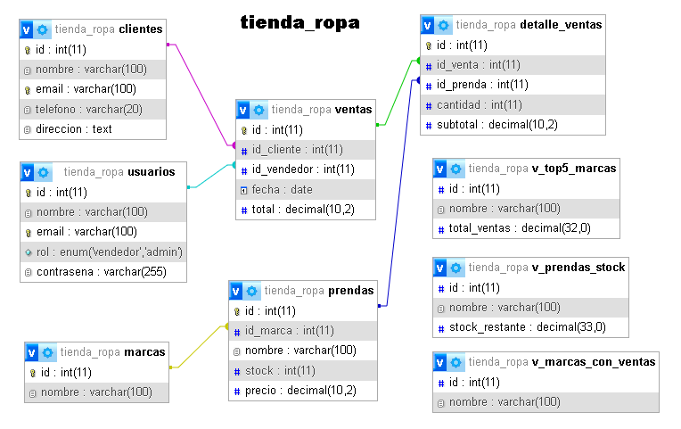

# Proyecto: Tienda de Ropa

## Descripción del Proyecto

Este proyecto tiene como objetivo la creación de una base de datos robusta para la gestión de una tienda de ropa. La base de datos maneja operaciones de ventas, gestión de prendas, marcas y clientes, facilitando el control de inventarios y el seguimiento de las transacciones de la tienda.

### Funcionalidades

- **Gestión de usuarios**: Administra empleados y administradores de la tienda.
- **Gestión de marcas y prendas**: Controla el stock y los precios de las prendas por marca.
- **Gestión de ventas**: Permite registrar ventas, clientes y productos vendidos.
- **Consultas avanzadas**: Ofrece información detallada sobre ventas, stock y marcas más vendidas.

Este sistema está diseñado para agilizar el manejo de la tienda y mejorar la experiencia tanto del personal como de los clientes.

## Diagrama de la Base de Datos

El siguiente diagrama ilustra cómo se relacionan las tablas de la base de datos:



## Estructura de la Base de Datos

- **Usuarios**: Información de empleados y administradores.
- **Clientes**: Datos de los clientes registrados.
- **Marcas**: Marcas disponibles en el inventario.
- **Prendas**: Detalles de cada prenda (nombre, precio, stock, marca).
- **Ventas**: Registro de transacciones realizadas.
- **Detalle de Ventas**: Información detallada de los productos vendidos en cada venta.

## Consultas

Consultas disponibles para obtener información clave:

1. **Cantidad de prendas vendidas por fecha**
2. **Marcas con ventas registradas**
3. **Top 5 marcas más vendidas**
4. **Prendas vendidas y su stock restante**

## Estructura del Repositorio

- **`crear_base_de_datos.sql`**: Crea la estructura principal de la base de datos.
- **`insertar_datos.sql`**: Inserta datos de prueba.
- **`consultas.sql`**: Consultas útiles para reportes y análisis.
- **`vistas.sql`**: Vistas SQL para simplificar las consultas.
- **`eliminar_actualizar_datos.sql`**: Elimina o actualiza registros según sea necesario.

## Interfaz Web (Front-End)

La aplicación incluye una interfaz web desarrollada con **HTML**, **CSS**, **JavaScript** y **Bootstrap 5**. Permite la gestión dinámica del sistema a través de una experiencia visual amigable.

### Archivos principales

- **`index.html`**: Estructura principal de la interfaz.
  - Encabezado con botón para agregar prendas.
  - Tablas dinámicas para:
    - Listado de prendas.
    - Prendas vendidas y stock restante.
    - Marcas con ventas.
    - Top 5 marcas más vendidas.
  - Modal interactivo para agregar o editar prendas.

- **`styles.css`**: Estilos personalizados para:
  - Mejorar la presentación visual de tablas, botones y formularios.
  - Aplicar diseño responsivo adaptable a dispositivos móviles.

- **`script.js`**: Lógica de interacción del front-end.
  - Obtiene y muestra los datos desde la API.
  - Permite crear, editar o eliminar prendas.
  - Detecta si una marca es nueva y la registra automáticamente.
  - Recarga las tablas tras cada operación sin necesidad de recargar la página.

### Características clave

- Modal para edición/registro de prendas.
- Autocompletado y registro de nuevas marcas desde el formulario.
- Sincronización automática de la interfaz tras cualquier cambio.
- Diseño limpio, responsivo y fácil de usar.

## Integrante del Proyecto

- **Arlor Aguilar**

## Instalación

Para ejecutar este proyecto en tu entorno local, sigue estos pasos:

1. Clona el repositorio en tu máquina local:
   ```bash
   git clone https://github.com/5WarlorD5/proyecto-parte-1-Arlor_Aguilar.git
   ```

